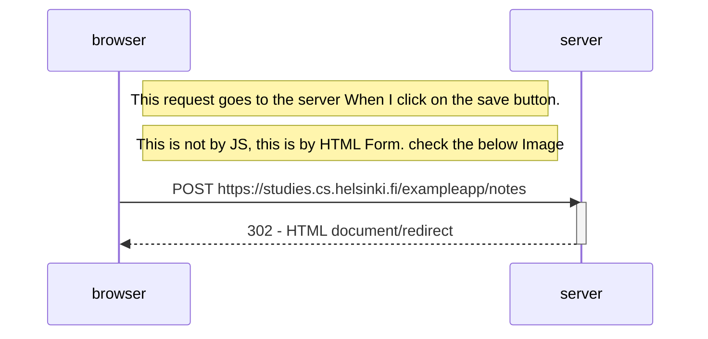
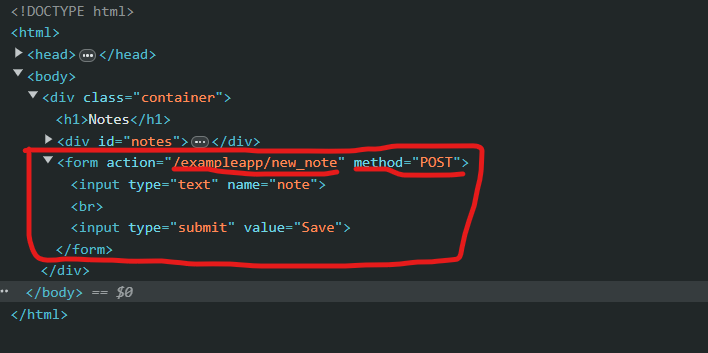
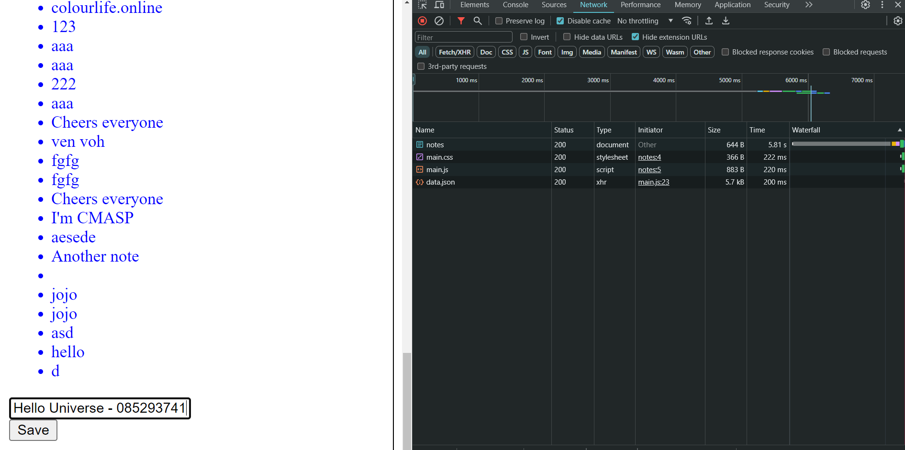
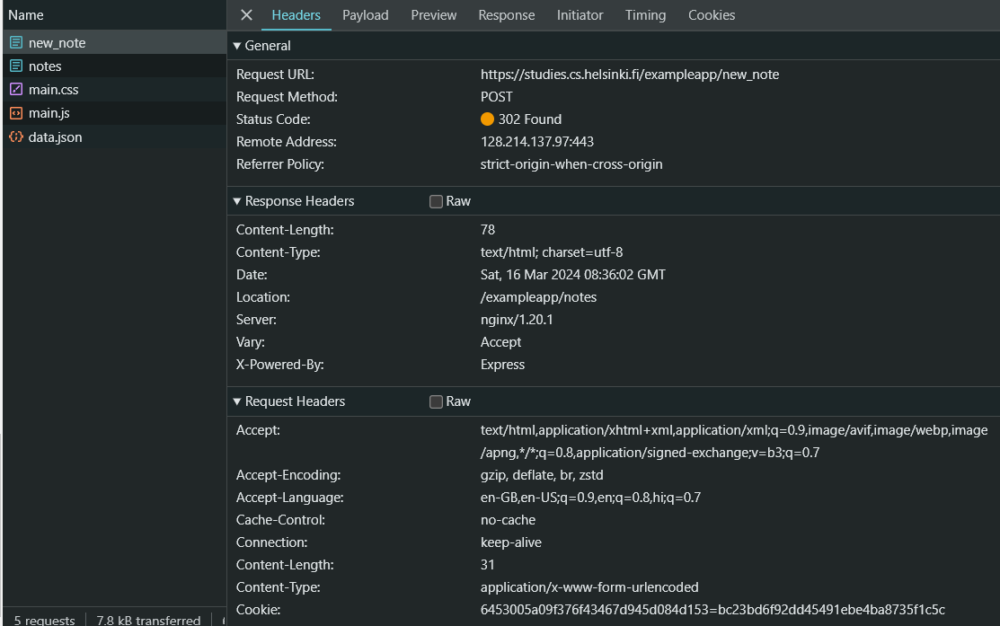

## Exercise - 04: Diagram Depicting the Situation of request and response
Here is the simple diagram depicting the situation where the user creates a new note on the page [https://studies.cs.helsinki.fi/exampleapp/notes](https://studies.cs.helsinki.fi/exampleapp/notes) 

# Diagram

<figure>

<figure-caption>Figure 1. Form Tag for sending POST request to the action url.</figure-caption>
</figure>

# Diagram in Points

1. First Enter the text
<figure>

<figure-caption>Figure 2. Enter Text in input field Image.</figure-caption>
</figure>

1. When I click on the **Save** Button, the Form tag make a POST request for this url **https://studies.cs.helsinki.fi/exampleapp/new_note**. As you can see in following image, and Server respond the  **302 Status Code**, That means request is done and it redirect me to same page, (I think this because it want to reload the page for show the changes)
<figure>

<figure-caption>Figure 3. Enter Text in input field Image.</figure-caption>
</figure>

# I think I explained it very well. If I made any mistake please let me know.