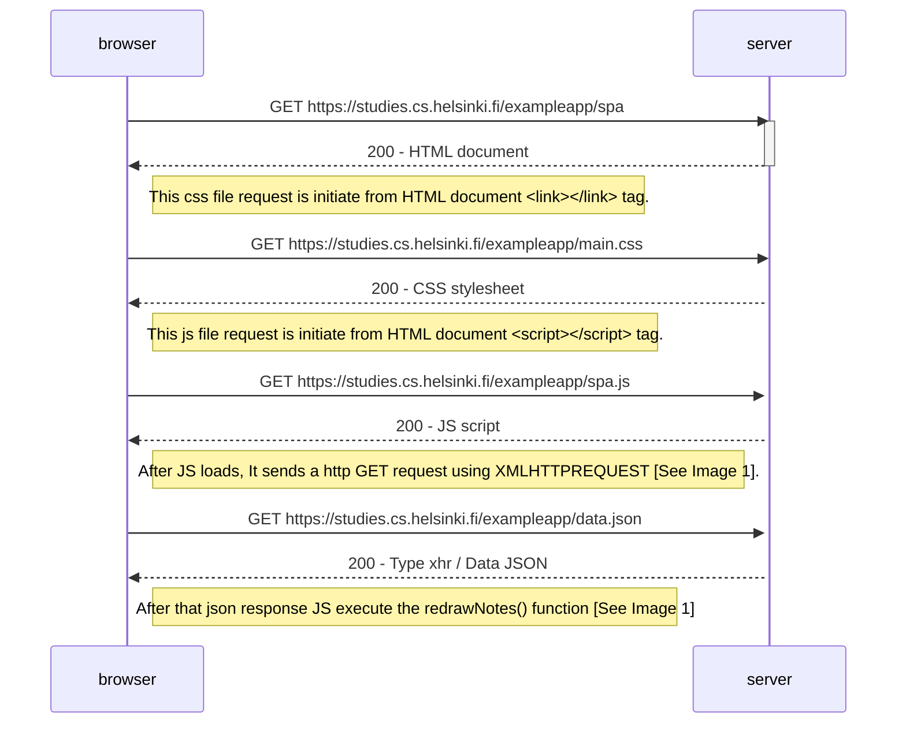
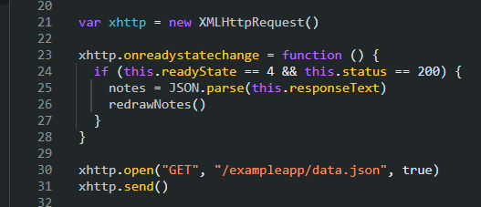

## Exercise - 05: Diagram depicting the situation where the user goes to the single page app of the note app
Here is the simple diagram depicting the situation where the user goes to the single page app of notes App [https://studies.cs.helsinki.fi/exampleapp/spa](https://studies.cs.helsinki.fi/exampleapp/spa) 

# Diagram

<figure>

<figure-caption>Figure 1. JS execute XML HTTP request to <em>/exampleapp/data.json</em></figure-caption>
</figure>

# I think I explained it very well. If I made any mistake please let me know.