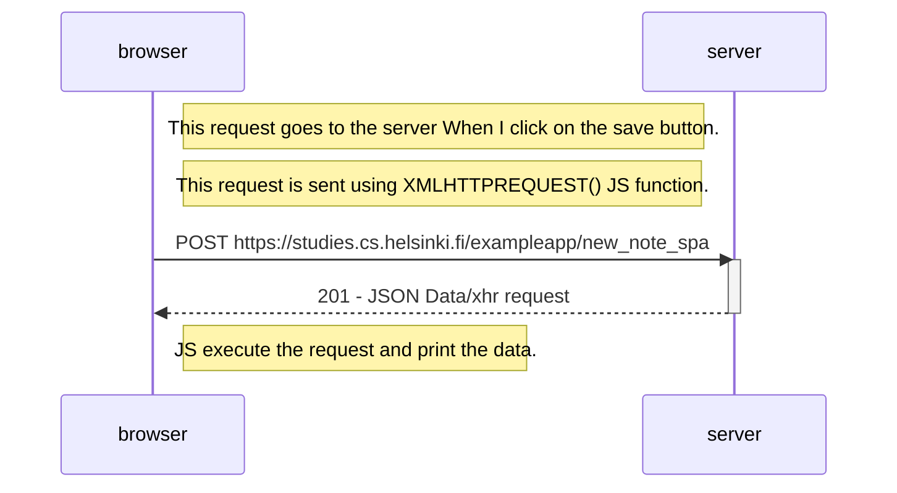
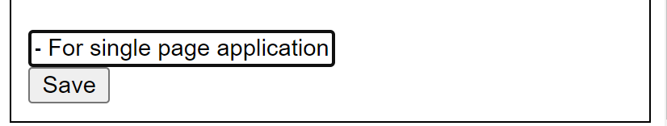
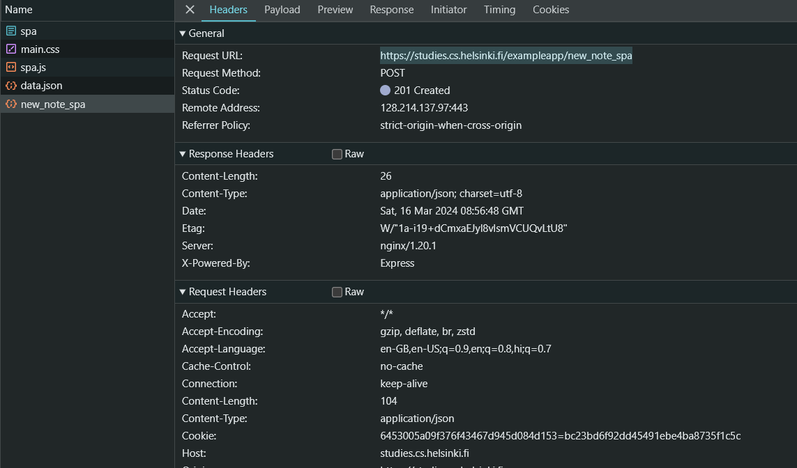
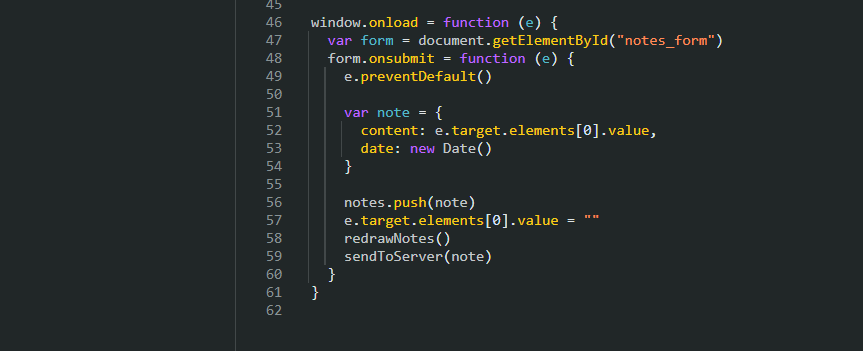

## Exercise - 06: New Note Diagram at Single Page Application Diagram
Here is the simple diagram depicting the situation where the user creates a new note on Single Page App, the page url [https://studies.cs.helsinki.fi/exampleapp/spa](https://studies.cs.helsinki.fi/exampleapp/spa) 

# Diagram



# <span style="color: lime;">Something Interesting in This request</span>

1. First Enter the text
<figure>

<figure-caption>Figure 1. Enter Text in input field Image.</figure-caption>
</figure>

2. When I click on the **Save** Button, the JavaScript file make a POST request for this url **https://studies.cs.helsinki.fi/exampleapp/new_note_spa**. As you can see in the following image. It returns 201 Status code means the request successfully fulfilled and something is return with it. It returns JSON data
   ```json
    {
        "message" : "note created"
    }
   ```

<figure>

<figure-caption>Figure 2. Enter Text in input field Image.</figure-caption>
</figure>

3. **What is interesting in it**, I saw you JS code, a js snippet screentshot is below, In this image you see clearly your ***redrawNotes()*** function is called before the ***sendToServer(note)*** function, means you already add this in the note without check the response (I mean without check it, it may be 404, 500, 403). I think you 😎 confident on your code or server. Sorry, if you fill odd, I only want to tell you about this <span style="color: orange">**Code Warning**</span>
   <figure>

<figure-caption>Figure 3. In this figure</figure-caption>
</figure>

# I think I explained it very well. If I made any mistake please let me know.